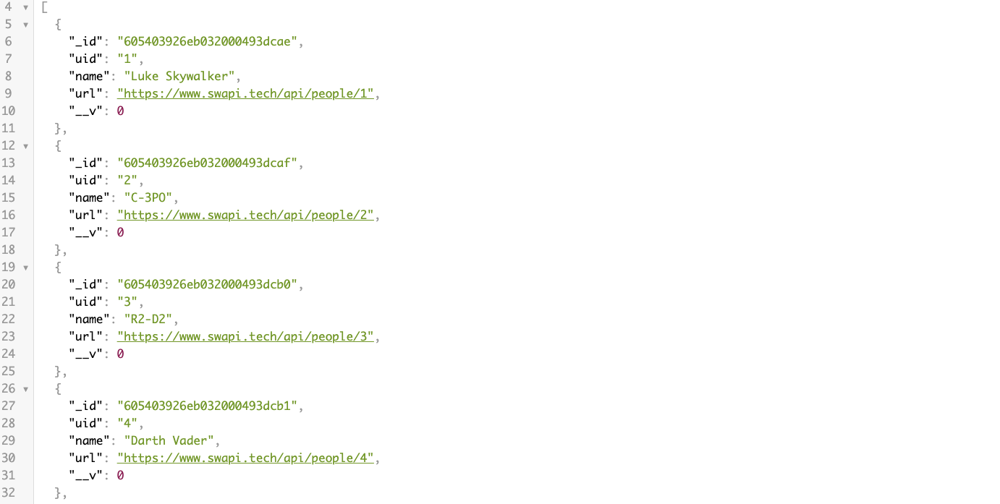

# CRUD Star Wars API

This project is a cloud based API with full CRUD functionality. You can find and edit information about some of your favorite Star wars characters on this API. Technologies used include Javascript, Express, MongoDB, Mongoose, & Heroku.



## Usage
You can access the API from the CLI by using http requests.

GET, POST, PUT, and DELETE requests are all possible.
the root directory is

```
https://six2121.herokuapp.com/things
```

#### GET

For example, a get request would be made like this from the CLI

```
http get https://six2121.herokuapp.com/things/
```

The above get request to the root directory will return all characters in the API. By adding an ID number to the end of the root directory you can make a targeted GET request. Each character ID has an "_id" in their respective object in the API for this purpose. This type of request would look like this:

```
http get https://six2121.herokuapp.com/things/6054967274542d00157732ba
```

#### PUT
For PUT requests you must use an ID on the end of the root directory. PUT requests must include information for updating the target object. The information to be updated can be added in key value pairs at the end of the request. The key value pairs should be written out as ```<key>=<value>``` Those requests would look as follows:


```
http put https://six2121.herokuapp.com/things/6054967274542d00157732ba name=bryanEmerson
```

The above request would change the name in the target object to bryanEmerson


#### DELETE
For Delete requests you must use an ID on the end of the root directory. Those requests would look as follows:


```
http delete https://six2121.herokuapp.com/things/6054967274542d00157732ba
```

The above request would delete the target object from the database.

#### POST
For Post requests you use the root directory and add your key value pairs at the end. The key value pairs should be written out as ```<key>=<value>``` Those requests would look as follows:


```
http post https://six2121.herokuapp.com/things/ uid=12 name=bryan url=www.google.com
```


The above request would create a new object in the API as follows:

```
{
    "__v": 0,
    "_id": "6054967274542d00157732ba",
    "name": "bryan",
    "uid": "12",
    "url": "www.google.com"
}
```

please note that the "__v" and "_id" key value pairs are generated automatically.


## Contributing
If you are going to make changes, please open an issue first to discuss what you would like to change.

Happy Coding!


